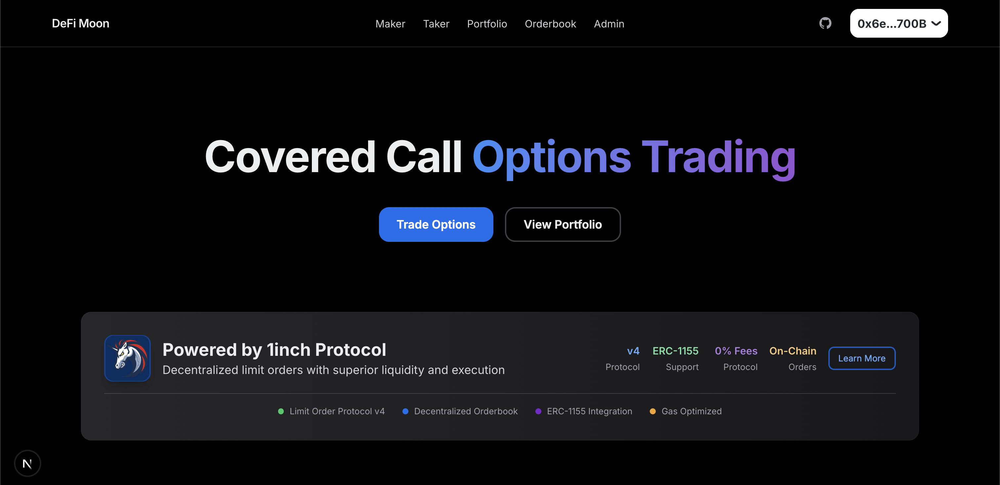

# DeFi Moon - Covered Call Options Trading Platform



A decentralized covered call options trading platform built on Gnosis Chain, featuring ERC-1155 option tokens and 1inch Limit Order Protocol v4 integration for trustless trading.

## 🌟 Features

- **Covered Call Options**: Create and trade covered call options backed by GNO collateral
- **ERC-1155 Option Tokens**: Custom ERC1155 Proxy Implementation as Options are represented as tradeable ERC-1155 tokens
- **1inch Integration**: Trustless orderbook using 1inch Limit Order Protocol v4
- **Oracle-Based Settlement**: Chainlink oracle integration for fair option settlement
- **Pro-Rata Exercise**: Sophisticated exercise and reclaim mechanics with accurate PnL tracking
- **Multi-Role Architecture**: Separate interfaces for option makers, takers, and administrators

## 🚀 Quick Start

### Prerequisites

- Node.js 18+ and npm/yarn
- MetaMask or compatible wallet
- Gnosis Chain RPC 

### Installation

```bash
# Clone the repository
git clone https://github.com/skundu42/defi-moon
cd defi-moon

# Install dependencies
npm install

# Set up environment variables
cp .env.example .env.local

# Start the development server
npm run dev
```

### Environment Configuration

Create a `.env.local` file with the following variables:

```bash
# WalletConnect Project ID (for RainbowKit)
NEXT_PUBLIC_WC_PROJECT_ID=your_walletconnect_project_id

# Network Configuration
NEXT_PUBLIC_CHAIN_ID=100
NEXT_PUBLIC_GNOSIS_RPC_URL=https://rpc.gnosis.gateway.fm


# ─── 1inch Limit Order Protocol v4 (Gnosis) ───────────────────────────────────
# LOP (settlement contract) – do not change on Gnosis
NEXT_PUBLIC_LOP=0x111111125421ca6dc452d289314280a0f8842a65


# Contract Addresses (deployed on Gnosis Chain)
NEXT_PUBLIC_VAULT_ADDRESS=0x42AD721db31C6eb65d8332BF0F7E26bff1eB9f6b
NEXT_PUBLIC_CALLTOKEN_ADDRESS=0x25D2203b0e4908594009A6e18b175f5996b08375
NEXT_PUBLIC_ERC1155_PROXY_ADDRESS=0x5EaF7a20901e87FD60E4414E82C1c7e58903F713
NEXT_PUBLIC_ORACLE_GNO_WXDAI=0x25bF72c741Ea8833154AC093f341D0A6434278d2

# Block number when vault was deployed (for faster event scanning)
NEXT_PUBLIC_VAULT_DEPLOY_BLOCK=12345678

# Token Addresses (optional overrides)
NEXT_PUBLIC_TOKEN_WXDAI=0xe91D153E0b41518A2Ce8Dd3D7944Fa863463a97d
NEXT_PUBLIC_TOKEN_USDC=0x2a22f9c3b484c3629090FeED35F17Ff8F88f76F0
NEXT_PUBLIC_TOKEN_GNO=0x9C58BAcC331c9aa871AFD802DB6379a98e80CEdb
```

## 📱 Application Structure

### For Option Makers

**Path: `/maker`**

1. **Series Management**: Define new option series with custom strikes and expiry dates
2. **Collateral Management**: Deposit/withdraw GNO collateral
3. **Option Minting**: Mint ERC-1155 option tokens backed by collateral
4. **Order Creation**: Create 1inch limit orders to sell minted options
5. **Settlement**: Settle expired series and reclaim unused collateral

### For Option Takers

**Path: `/taker`**

1. **Browse Orderbook**: View available ERC-1155 option orders
2. **Buy Options**: Fill limit orders to purchase option tokens
3. **Portfolio Management**: Track purchased options and their status
4. **Exercise Options**: Exercise profitable options at or after expiry

### For Administrators

**Path: `/admin`**

1. **Define Series**: Create new option series (requires `SERIES_ADMIN_ROLE`)
2. **Monitor Activity**: View all defined series and their status
3. **System Management**: Pause/unpause contracts and manage roles

## 🏗️ Architecture

### Smart Contracts

#### Core Contracts

- **OptionsVault.sol**: Main vault contract managing collateral, minting, and settlement
- **CallToken.sol**: ERC-1155 token representing option positions
- **ERC1155Proxy.sol**: 1inch-compatible proxy for ERC-1155 trading
- **ChainlinkPriceAdapter.sol**: Oracle adapter for GNO/WXDAI price feeds

#### Key Features

- **Access Control**: Role-based permissions for series creation and administration
- **Pausable Operations**: Emergency pause functionality for all user operations
- **Reentrancy Protection**: Guards against reentrancy attacks
- **Pro-Rata Settlement**: Fair distribution of exercise proceeds among option writers

### Frontend Stack

- **Next.js 14**: React framework with App Router
- **TypeScript**: Type-safe development
- **Tailwind CSS**: Utility-first styling
- **HeroUI**: Modern component library
- **Wagmi**: React hooks for Ethereum
- **RainbowKit**: Wallet connection interface
- **1inch Protocol**: Decentralized orderbook integration

### Integration Layer

- **1inch Limit Order Protocol v4**: Trustless order matching
- **Chainlink Oracles**: Reliable price feeds for settlement
- **ERC-1155 Standard**: Efficient option token representation
- **Gnosis Chain**: Low-cost, fast blockchain for DeFi

## 🔧 Development

### Project Structure

```
├── app/                    # Next.js App Router pages
│   ├── admin/             # Admin interface
│   ├── maker/             # Option maker interface  
│   ├── taker/             # Option taker interface
│   ├── portfolio/         # Portfolio management
│   └── api/               # API routes for orderbook
├── components/            # React components
├── lib/                   # Utilities and integrations
│   ├── contracts.ts       # Contract addresses and ABIs
│   ├── oneInch.ts         # 1inch Protocol integration
│   ├── orderApi.ts        # Orderbook API client
│   └── token.ts           # Token definitions
├── smartcontracts/        # Solidity contracts
│   ├── src/core/          # Core option contracts
│   ├── src/oracle/        # Price oracle adapters
│   └── src/token/         # ERC-1155 token contract
└── hooks/                 # Custom React hooks
```

### Building and Testing

```bash
# Development server
npm run dev

# Build for production
npm run build

# Start production server
npm start

# Type checking
npm run type-check

# Linting
npm run lint
```

### Contract Development

```bash
# Navigate to smart contracts directory
cd smartcontracts

# Install Foundry dependencies
forge install

# Compile contracts
forge build

# Run tests
forge test

# Deploy contracts (configure deployment script first)
forge script script/Deploy.s.sol --rpc-url gnosis --broadcast
```

## 🔐 Security Features

### Smart Contract Security

- **OpenZeppelin Libraries**: Battle-tested security primitives
- **Access Control**: Role-based permissions with admin controls
- **Reentrancy Guards**: Protection against reentrancy attacks
- **Pausable Operations**: Emergency stop functionality
- **SafeERC20**: Safe token transfer implementations

### Frontend Security

- **Type Safety**: Full TypeScript implementation
- **Input Validation**: Comprehensive input sanitization
- **Error Handling**: Graceful error recovery and user feedback
- **HTTPS Only**: Secure communication in production

### Economic Security

- **Overcollateralization**: Option writers must deposit full collateral
- **Oracle-Based Settlement**: Tamper-resistant price feeds
- **Pro-Rata Distribution**: Fair allocation of exercise proceeds
- **Expiry Enforcement**: Automatic option expiration

## 🎯 Usage Examples

### Creating a Covered Call

1. **Connect Wallet**: Connect your wallet to Gnosis Chain
2. **Deposit Collateral**: Deposit GNO tokens to the vault
3. **Define Series**: Create a new option series (if admin) or select existing
4. **Mint Options**: Mint option tokens backed by your collateral
5. **Create Order**: List your options on the 1inch orderbook
6. **Await Exercise**: Options may be exercised if they finish in-the-money

### Buying Options

1. **Browse Orderbook**: View available option orders
2. **Select Options**: Choose options based on strike, expiry, and premium
3. **Fill Order**: Purchase options using WXDAI, USDC, or other supported tokens
4. **Monitor Position**: Track your options in the portfolio section
5. **Exercise if Profitable**: Exercise in-the-money options after expiry

### Settlement Process

1. **Option Expiry**: Options automatically expire at the set timestamp
2. **Price Settlement**: Oracle provides the settlement price
3. **Exercise Period**: Option holders can exercise profitable positions
4. **Reclaim Collateral**: Option writers reclaim unused collateral

## 🌐 Deployment

### Contract Deployment

The smart contracts are deployed on Gnosis Chain at the following addresses:

- **OptionsVault**: `0x42AD721db31C6eb65d8332BF0F7E26bff1eB9f6b`
- **CallToken**: `0x25D2203b0e4908594009A6e18b175f5996b08375`
- **ERC1155Proxy**: `0x5EaF7a20901e87FD60E4414E82C1c7e58903F713`
- **Oracle**: `0x25bF72c741Ea8833154AC093f341D0A6434278d2`

### Frontend Deployment

The application can be deployed to any modern hosting platform:

```bash
# Build for production
npm run build

# Deploy to Vercel
vercel deploy

# Or deploy to other platforms
npm run start
```

## 🔗 Integration with 1inch

### Order Creation

Options are traded using 1inch Limit Order Protocol v4:

1. **ERC-1155 Extension**: Custom extension data for option token identification
2. **Proxy Integration**: ERC1155Proxy contract enables ERC20-style trading
3. **Order Signing**: EIP-712 signatures for trustless order creation
4. **Orderbook Storage**: Decentralized order storage and matching

### Order Execution

1. **Order Discovery**: Browse orders through the integrated orderbook
2. **Price Validation**: Real-time pricing and liquidity information
3. **Atomic Settlement**: Trustless execution via 1inch smart contracts
4. **Partial Fills**: Support for partial order execution
